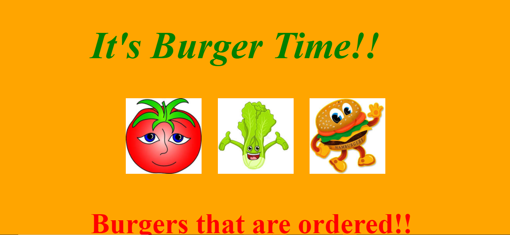

# EatDaBurger
# Unit 13 Homework: E-Commerce Back End
  

  
 ## Table of Contents
  
* [Description](#Description)
  
* [Installation](#Installation)
  
* [Usage](#Usage)
  
* [License](#License)
  
* [Contributors](#Contributors)
  
* [Questions](#Questions)
  
 ## Description 
  
In this assignment I created a burger logger with MySQL, Node, Express, Handlebars and a homemade ORM . I was sure to follow the MVC design pattern using Node and MySQL to query and route data in my app, and Handlebars to generate your HTML.

 

 ## Installation
  
 💾 
  
* npm install
  
* npm install express
* npm install express-handlebars

   
 ## Usage

 
 
LANGUAGES USED ARE:
 

- HTML
- CSS
- JAVASCRIPT
- NODE.JS

* Use the [MySQL](https://www.npmjs.com/package/mysql) NPM package to connect to your MySQL database and perform queries.
  

 ## License
 To view the license click [here](https://choosealicense.com/licenses/mit/)

  
 ## Contributors
  
 Contributions are accepted. Feel free to fork.
1. Fork it
2. Create your feature branch (git checkout -b feature/fooBar)
3. Commit your changes (git commit -am 'Add some fooBar').
4. Push to the branch (git push origin feature/fooBar)
5. Create a new Pull Request# RfHogans

  
  
 ## Questions
  
 If you want have any additional questions, you can reach me at
  
 **Github**: https://github.com/rabiahfh
  
 **Email**: hogansrabiah@gmail.com

``